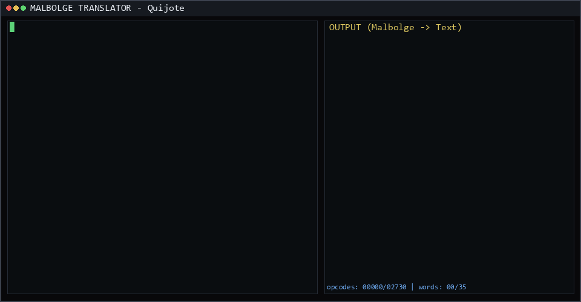

# Malbolge Translator

**Generate pure Malbolge programs that print arbitrary text exactly.**



This tool uses incremental machine-state synthesis with periodic anchor resets to make Malbolge text generation practical for arbitrarily long texts.

## How It Works

Malbolge is a self-modifying, counter-machine language where every instruction depends on the complete machine state. Traditional approaches try to generate the entire program at once, which is infeasible for long texts.

This translator decomposes the problem:

```
[Bootstrap: i + o*99] → Anchor State (clean memory, no output)
        ↓
[Word 1 continuation] → [Word 2 continuation] → ... → [Word N + halt]
        ↓                    ↓
   (machine state    (machine state
    advances)           advances)
        ↓
[Every N words: Bridge → Reset to Anchor → Continue]
```

- **Anchor**: A canonical machine state reached by a fixed bootstrap sequence. Identified by a hash of (A, C, D, tape[:100]).
- **Continuation**: Opcodes that, when executed *from a specific machine state*, produce the next word.
- **Word Bank**: Cache of (anchor_hash, word) → continuation. Only valid when machine state matches the anchor.
- **Linear Chaining**: Each word's continuation executes from the previous word's final state.

The result is **one linear opcode stream** with **one final halt** (`v`).

## Installation

```bash
# Requires Python 3.10+
pip install malbolge-generator
pip install -e .
```

Or from source:

```bash
git clone <this-repo>
cd Malbolge-Translator
pip install -e .
```

## Quick Start

```bash
# Transliteration (human-readable, lossy)
malbolge-translate "Hola mundo" --execute
malbolge-translate "你好" --direct --execute

# Exact reversible UTF-8 roundtrip (byte-exact)
malbolge-translate "你好，世界 😭🔥" --direct --roundtrip --execute
malbolge-translate "Hola, señor. ¿Cómo estás?" --direct --roundtrip --execute

# Translate file
malbolge-translate input.txt --output-dir out --execute
malbolge-translate input.txt --roundtrip --output-dir out --execute

# With custom lexicon mappings (transliteration mode only)
malbolge-translate "Hola 世界" --lexicon-add 世 shi --lexicon-add 界 jie --execute
```

## Generate Don Quijote (Demo Artifact)

```bash
# Downloads from Project Gutenberg, generates full .mal
malbolge-quijote --output-dir artifacts/quijote --execute
```

This creates:
- `artifacts/quijote/quijote_full.mal` — pure Malbolge program (~50 MB)
- `artifacts/quijote/quijote_full.op` — raw opcodes
- `artifacts/quijote/manifest.json` — metadata (per-chapter manifests live in
  `artifacts/quijote/chapter_NNN/quijote_chNNN_manifest.json`)

## Modes

### Mode A — Transliteration (lossy, human-readable)

```
input Unicode → human-readable ASCII approximation → Malbolge → approximation
```

Properties: readable = usually yes, reversible = no, byte exact = no.
Example: `"你好" → "nihao"`, `"ñ" → "ny"`. Useful for display but not byte-exact.

### Mode B — Exact UTF-8 Roundtrip (reversible, byte-exact)

```
ORIGINAL UTF-8 TEXT → reversible ASCII envelope (MALRT1) → pure Malbolge program → canonical execution → ASCII payload → decode → ORIGINAL UTF-8 TEXT
```

Envelope: `MALRT1:<base64(utf8_bytes)>:<sha256_hex>`. Deterministic, ASCII-safe, versioned, integrity-checked.
Properties: readable payload = irrelevant, reversible = yes, byte exact = yes when verification passes.

**Claims (until demonstrated otherwise):**

```
MALBOLGE_NATIVE_UNICODE = FALSE
TRANSLITERATION_REVERSIBLE = FALSE
ROUNDTRIP_BYTE_EXACT = TRUE only for passing verified runs
FULL_DON_QUIJOTE_UTF8_ROUNDTRIP = NOT_DEMONSTRATED
ARBITRARY_SIZE_ROUNDTRIP = NOT_DEMONSTRATED
```

Roundtrip mode can preserve arbitrary valid UTF-8 text byte-for-byte, subject to Malbolge synthesis/execution resource limits.
Do not claim "supports every language" — it is byte transport, not linguistic coverage.

```python
from malbolge_translator import MalbolgeTranslator, encode_roundtrip, decode_roundtrip

# Codec alone (no Malbolge)
payload = encode_roundtrip("你好，世界 😭🔥")
assert decode_roundtrip(payload) == "你好，世界 😭🔥"

# Full transport over Malbolge
translator = MalbolgeTranslator()
result = translator.translate_roundtrip("你好，世界 😭🔥")
verification = translator.verify_roundtrip(result)
# verification.original_utf8_sha256, verification.recovered_utf8_sha256, verification.bytes_equal, verification.sha_equal, verification.malbolge_execution_status, verification.malbolge_steps, verification.encoded_payload
assert verification.roundtrip_pass
```

### CLI distinction

```bash
# Human-readable transliteration
malbolge-translate "你好" --direct --execute

# Exact reversible UTF-8
malbolge-translate "你好" --direct --roundtrip --execute

# File workflows
malbolge-translate input.txt --output-dir out --execute
malbolge-translate input.txt --roundtrip --output-dir out --execute
```

Roundtrip execution output distinguishes layers:

```
Mode: UTF-8 roundtrip
Original bytes: 18
Encoded payload chars: 96
Malbolge program chars: 12450
Execution: HALTED
Payload match: TRUE
UTF-8 bytes match: TRUE
SHA256 match: TRUE
ROUNDTRIP: PASS
```

## Architecture

### Core Components

| Module | Purpose |
|--------|---------|
| `translator.py` | Main translation pipeline: lexicon → split → synthesize → chain + `translate_roundtrip` / `verify_roundtrip` |
| `roundtrip.py` | Reversible UTF-8 codec: `MALRT1:<base64>:<sha256>` (no Malbolge logic) |
| `anchor.py` | AnchorManager, WordBank — canonical states & continuation cache |
| `lexicon.py` | User-extensible character mappings (transliteration/encoding) |
| `cli.py` | Command-line interface (`--roundtrip`, `--show-program`) |
| `render_session.py` | Session GIF renderer (like FLOW's session.gif) |

### Public API

```python
from malbolge_translator import MalbolgeTranslator, Lexicon, encode_roundtrip, decode_roundtrip

# Transliteration (existing)
translator = MalbolgeTranslator(anchor_interval=50)
result = translator.translate("Hello world")
translator.execute(result)  # verifies exact output

# Roundtrip (new)
result = translator.translate_roundtrip("你好，世界 😭🔥")
verification = translator.verify_roundtrip(result)
# or
result, verification = translator.translate_and_verify_roundtrip("Hola, señor", max_steps=5_000_000)

# Custom lexicon (transliteration only)
lex = Lexicon()
lex.add("ñ", "ny")
lex.add("中", "zhong")
translator = MalbolgeTranslator(lexicon=lex)
```

## Lexicon / Encoding

The tool includes a built-in lexicon with 300+ mappings (transliteration, lossy):

- Spanish: `áéíóúñ` → `aeiouny`
- French: `àâäçèêë` → `aaceee`
- German: `ßäöü` → `ssaeoeue`
- Greek/Cyrillic/Chinese/Japanese/Korean
- Symbols, math, arrows, box drawing, emoji

**Important — Mode A (transliteration)**: lossy approximation. `TRANSLITERATION_REVERSIBLE = FALSE`. Original bytes are not preserved.

**Mode B (roundtrip)** provides exact preservation via reversible codec (`roundtrip.py`). No transliteration is used there; original UTF-8 bytes survive exactly.

Add custom mappings (transliteration mode only):
```bash
malbolge-translate "text" --lexicon-add 世 shi --lexicon-add 界 jie
```

## Exact Output Guarantee

Every `--execute` run performs:

```
synthesize → canonical interpreter → exact comparison → MATCH / MISMATCH
```

The canonical interpreter is the standard Malbolge interpreter (3^10 memory, crazy-op, self-encryption). No custom extensions.

- **Transliteration mode**: `MISMATCH` vs original is expected (approximation); `MATCH` vs transliterated is verified.
- **Roundtrip mode**: `verification.bytes_equal` + `sha_equal` + `payload_match` + `HALTED` must all be `TRUE` for `ROUNDTRIP: PASS`. See `evidence/roundtrip/` and `docs/ROUNDTRIP_FORMAT.md`.

Artifacts: `*_manifest.json` now includes `mode`, `codec_version`, `original_sha256`, `payload_sha256`, `malbolge_execution_status`, `payload_match`, `bytes_match` etc (schema v2 for roundtrip, v1 for transliteration — versioned, not overwritten).
```
MALBOLGE_NATIVE_UNICODE = FALSE  # Malbolge has no native Unicode; UTF-8 transport is via ASCII codec over Malbolge

UTF8_REVERSIBLE_TRANSPORT_OVER_MALBOLGE = DEMONSTRATED only when end-to-end tests pass (see docs/AUDIT_ROUNDTRIP.md)
```

## Requirements

- Python 3.10+
- `malbolge-generator` package (provides ProgramGenerator, MalbolgeInterpreter)

## Testing

```bash
# Run basic tests
malbolge-translate "Hola mundo" --execute
malbolge-translate "The quick brown fox" --execute
malbolge-translate "def foo(): return 42" --execute
```

## License

MIT